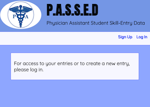
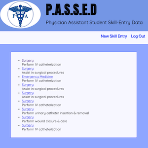

# PASSED
> physician assistant student skill evaluation data

## Table of Contents
* [Introduction](#introduction)
* [Live Link](#live-link)
* [Technologies](#technologies)
* [Dependencies](#dependencies)
* [User Stories](#user-stories)
* [Project Status](#project-status)
* [Future Development](#future-development)

## Introduction
Physician Assistant Student Skill Evaluation Data, or PASSED is a full CRUD app which allows students to log into their account, currently a mock-up designed to mirror an account assigned by a school: username, password, full name, student ID.

Once logged in, students can create entries based on what rotation they are studying, and select a skill within that rotation. They also select a preceptor, and a number indicating their proficiency, with 1 being observation only, and 4 being allowed to perform the skill with minimal supervision.

PASSED tracks all skill entries made by all students. Students are allowed to add entries, and administrators are allowed to view all entries of all students, as well as edit or delete entries.

## Live Link
https://caducus-passed.herokuapp.com/

## Technologies
* HTML / CSS
* NodeJS
* MongoDB
* Heroku

## Dependencies
* bcrypt v.3.0.6
* dotenv v.8.0.0
* ejs v.2.6.2
* express v.4.17.1
* express-session v.1.16.2
* method-override v.3.0.0
* mongoose v.5.6.8

## User Stories

---
* As a user, I should be able to create an account that is password protected.
* As a user, when I log in, I should be greeted by name, and given a link to proceed to my list of entries.
---

---
* As a user, when I click "New Skill Entry", I should be given a simple, intuitive drop down form that populates based on my Rotation selection.
* As a user, when I click on an individual entry, I should be able to edit, update, and delete it.
> this is simply to reach full crud; in future versions, students will not be given this access, however admins will always be allowed to edit, update, and delete.

## Project Status
This project is currently complete, however I plan to revisit and improve it at a later date.

## Future Development
This app is still in development. Ultimate goals are as follows:
* On the students show page: rather than listing all entries, only rotations will be listed. Upon clicking the rotation, skills within that rotation will be listed. Upon clicking the skill, all of the logged-in student entries that match both that rotation and skill will be listed, as well as a graph that shows the level of proficiency as it appears from first entry to final entry.
* On the admin show page: rather than listing all entries, only student names will be listed. Upon clicking the students name, a similar set-up to the above will appear - that student's rotations, that student's skills within each rotation, and finally a list of all entries that match both skill and rotation with a graph that shows the level of proficiency as it appears from the first to the final entry.
* On the student's new page: before being allowed to submit a new entry, the preceptor selected must enter a 4-digit verification code to approve the entry.
* The short term goal is to use a code to verify the preceptor's approval of the entry. The long term goal is to use fingerprint technology. In theory, this app will be on the student's phone. The student will select all information for the new entry, hand the phone to the preceptor to sign off, and assuming the phone itself is fingerprint-capable, the preceptor will be able to simply use their fingerprint to verify their identity.
